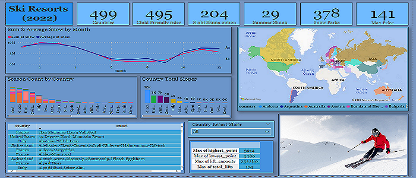
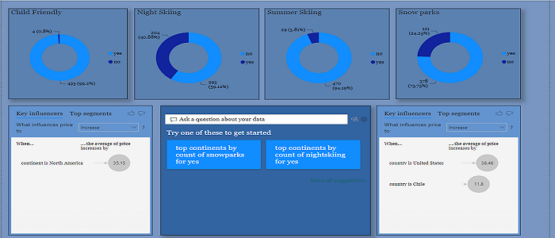

### **Ski Resort (2022) Analysis**

This project was accomplished using two Python programming language & Microsoft PowerBI. 

The original data can be found in the **original_data** folder

Python was primarily used for the following;
- Loading the data.
- Getting to know the data.
    - *Renaming columns.*
    - *Data cleaning.*
- Memory management. 
- Feature engineering.
- Exploratory data analysis. 
- Drawing observations and conclusions from plots, tables and other visualisations.

Please kindly check **ski_resort.ipynb** for the analysis using Python.

Using Python laid the foundation for Microsoft PowerBI visualisations which could be seen in the the **powerbi_analysis** folder. This was made using the **ski_resort_snow.xlsx** dataset produced from the Python analysis found in the **my_data** folder.

### **Some images from PowerBI**

 

### **Conclusion**

- From the observations, I would recommend the following countries to families because of their child friendly resorts;

- Austria
- France
- USA (some resorts are not child friendly)
- Switzerland
- Italy